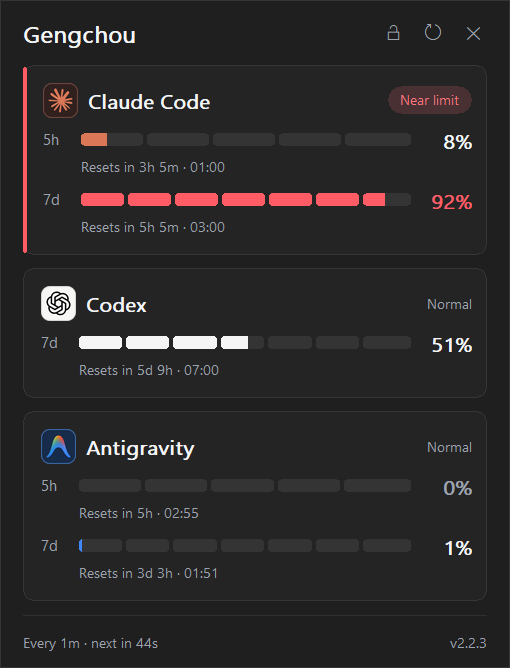
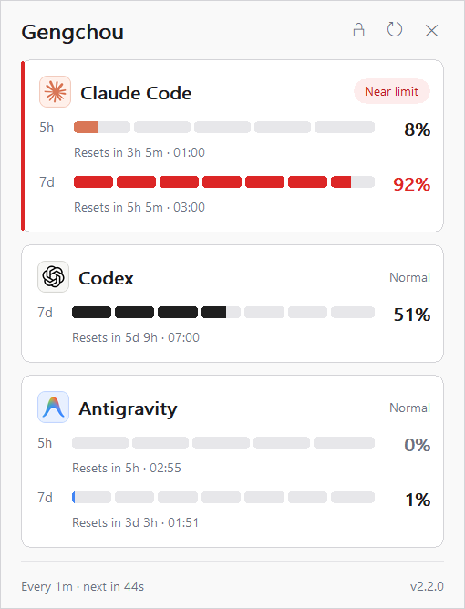
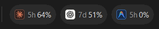
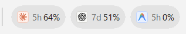
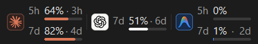
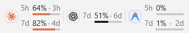
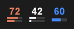
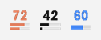
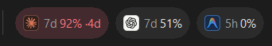

**English** | [简体中文](README.zh-CN.md)

<!-- Keep user-facing behavior, installation, privacy, and release status aligned with README.zh-CN.md. -->
<!-- Every preview image is rendered by the app itself; regenerate with tools\render-readme-images.ps1. -->

<div align="center">

# Gengchou

**AI quota at a glance.**

<sub>AI quota monitor for the Windows taskbar</sub>


[](https://github.com/ynjmxn/gengchou/actions/workflows/ci.yml)
[](https://github.com/ynjmxn/gengchou/releases/latest)
[](LICENSE)

 

<sub>The detail popup in dark and light — including what a near-limit warning looks like.</sub>

</div>

Gengchou puts the quota windows your AI providers actually report — how much
is used, and when it resets — directly on the Windows taskbar. Claude Code,
Codex, and Antigravity each get a live percentage on whichever surface you
prefer, from a full detail card down to a single tray number, so checking
your remaining budget never means opening a dashboard.

> 烧香知夜漏，刻烛验更筹。
>
> — Yu Jianwu, 《奉和春夜应令》, Southern Liang

The name *Gengchou* (更筹) comes from the tally sticks used to mark the watches
of the night; by extension, the term can also refer to time itself. These
tally sticks made the passing hours visible; the app does the same for quota
usage and reset cycles.

## Surfaces at a glance

|  | Dark | Light |
| ---: | :--- | :--- |
| **Taskbar widget** |  |  |
| **Floating window** |  |  |
| **Tray icons** |  |  |

These previews are not screenshots: the app rendered them through its own
`--dump-widget`, `--dump-tray-icons`, and `--dump-detail-popup` modes, so they
show the exact pixels the shipped code draws. Regenerate them any time with
[`tools/render-readme-images.ps1`](tools/render-readme-images.ps1).

- **Taskbar widget.** Embeds in the taskbar itself: one content-sized badge
  per provider showing its logo, quota-window label, and short-window usage.
  Hover a badge to see every reported window with reset times. Drag the left
  divider to reposition it, or drop it on another taskbar to change monitors.
  If Explorer is temporarily gone, the widget hides and re-embeds rather than
  landing on the desktop.
- **Floating window.** A separate always-on-top numeric view, not a stretched
  copy of the widget: up to the two highest-usage windows per provider, each
  label, percentage, and countdown aligned above its micro gauge. Drag it from
  anywhere on its surface; a short click still opens the detail popup. It
  remembers its position, keeps an 8-pixel margin inside the work area, and
  can be reset from **Settings**.
- **Tray icons.** One live icon per enabled provider — the number and adaptive
  bars follow whatever quota windows that provider reports; with no data the
  number gives way to the provider's initial. Disable **Icons** to keep a
  single neutral app icon instead.
- **Detail popup.** Opens from a left-click on any surface: per-provider
  status badges, exact reset clock times, a live refresh countdown, and a
  temporary position lock for the current opening.

When any quota window reaches 90%, it takes over that provider's badge, turns
it red, and shows its own reset countdown — the warning finds you, not the
other way around:

<div align="center">

</div>

## Install

Installation options, in recommended order:

1. **Portable ZIP (recommended).** Download
   `gengchou-windows-x64.zip` from the
   [latest release](https://github.com/ynjmxn/gengchou/releases/latest),
   extract it to any folder you can write to, and run `gengchou.exe`. The
   bundle includes both READMEs and the retained license and attribution
   notices.

2. **Standalone EXE.** For a single-file download, get `gengchou.exe` from
   the same release and run it from any writable folder.

3. **WinGet (when available).** The package uses this identifier:

   ```powershell
   winget install --id ynjmxn.Gengchou --exact
   ```

   If WinGet cannot find it yet, use the ZIP or EXE instead.

The executable is currently unsigned. Each release includes `SHA256SUMS` for
download verification, and self-updates check it automatically. Starting with
v2.1.0, release binaries also carry GitHub artifact attestations; these provide
build provenance but do not replace Authenticode signing.

The similarly named `CodeZeno.ClaudeCodeUsageMonitor` package is the
original project, not this app.

<details>
<summary><b>Build from source</b> (Windows 10/11, stable Rust)</summary>

```powershell
git clone https://github.com/ynjmxn/gengchou.git
cd gengchou
cargo build --release --locked
.\target\release\gengchou.exe
```

</details>

Release maintainers should also follow the
[release checklist](docs/RELEASE_CHECKLIST.md).

## Controls

- **Left-click** the widget or a tray icon to open or close the detail popup.
- The popup is movable by default; its lock button pins it for the current
  opening, and closing it restores automatic placement.
- **Right-click** any surface, then click **Icons**, **Widget**, or
  **Floating Window** directly to toggle that surface. Position resets,
  notifications, and start-with-Windows live under **Settings**.
- **Refresh** polls immediately with **Now** or sets the automatic interval.

## Beyond the surfaces

- Quota data comes from what each provider actually reports — windows and
  reset times are never guessed or extrapolated
- Enable any combination of Claude Code, Codex, and Google Antigravity
- Windows system colours in High Contrast mode
- Optional reset notifications (off by default)
- Survives `explorer.exe` restarts and RDP / lock-screen transitions; polling
  keeps its cadence while the session is locked, and restoration only rebuilds
  local UI surfaces
- Multi-monitor and multi-taskbar aware
- 11 languages · no telemetry · a single ~1 MB portable executable

## Provider requirements

The monitor only reads your existing local sessions — it never creates
accounts or bypasses provider authentication, and what it can show follows
each provider's own account rules:

- **Claude Code** — installed and signed in (WSL credentials are picked up
  when a usable distribution exists)
- **Codex** — a signed-in Codex Desktop or CLI session; the CLI executable is
  not required when Desktop has already saved a supported local session
- **Antigravity** — a signed-in Antigravity session

## Data & privacy

| What | Where |
| --- | --- |
| Settings | `%APPDATA%\Gengchou\settings.json` |
| Usage cache — percentages, quota-window metadata, and reset times only; never tokens | `%APPDATA%\Gengchou\usage-cache.json` |
| Diagnostics (append-only, rotated) | `%LOCALAPPDATA%\Gengchou\diagnose.log` |

v2.3.0 reads and writes only the Gengchou paths above. Installations older than
v2.2.4 must first run the retained v2.2.4 bridge twice and complete its
verification before moving to v2.3.0 or later.

To uninstall: disable **Start with Windows** if you enabled it, then delete
the executable, `%APPDATA%\Gengchou`, and `%LOCALAPPDATA%\Gengchou`.

Network traffic goes directly to the enabled providers (Anthropic,
ChatGPT/Codex, Google) for read-only usage queries, plus GitHub for update
checks and user-approved update downloads. The app never:

- collects analytics or telemetry, or uploads any files;
- sends credentials anywhere except the provider that issued them;
- modifies your credentials;
- triggers model generation — no `claude -p`, `codex exec`, or calls to
  `/v1/messages`, `/v1/chat/completions`, and similar endpoints.

Provider bearer tokens travel inside each TLS request, so only configure
proxies you trust.

## Stability

The project began as a stability rework of the original code. External
`WM_DESTROY`, `explorer.exe` taskbar rebuilds, and RDP session switches
trigger in-process recovery — relaunch is only a last resort — and panics
are logged instead of silently ending the process. See
[PROVENANCE.md](PROVENANCE.md) for the technical summary.

## Acknowledgements & license

Formerly **AI Usage Monitor**, Gengchou was derived from
[CodeZeno/Claude-Code-Usage-Monitor](https://github.com/CodeZeno/Claude-Code-Usage-Monitor)
v1.4.8 (commit `9b29972`). The tray-icon presentation and parts of the Claude
usage polling, caching, cooldown, and rate-limit handling were adapted from or
informed by
[jens-duttke/usage-monitor-for-claude](https://github.com/jens-duttke/usage-monitor-for-claude).
This project is not affiliated with, endorsed by, or sponsored by Code Zeno
Pty Ltd, Anthropic, OpenAI, or Google. Product names are used only to
describe compatibility; all trademarks belong to their respective owners.

MIT License — see [LICENSE](LICENSE),
[THIRD_PARTY_NOTICES.md](THIRD_PARTY_NOTICES.md), and
[DEPENDENCY_LICENSES.md](DEPENDENCY_LICENSES.md) for retained notices.
