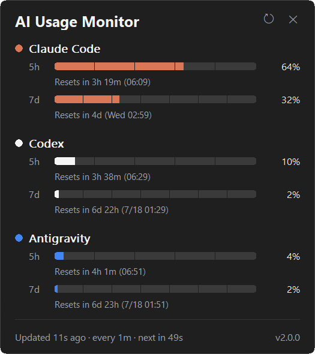

[English](README.md) | **简体中文**

<!-- 修改用户可见行为、安装方式、隐私说明或发布状态时，请同步更新 README.md。 -->

<div align="center">

# AI Usage Monitor

**在 Windows 任务栏直接查看 Claude Code · Codex · Antigravity 用量。**


[](https://github.com/yinjianxxx/ai-usage-monitor/actions/workflows/ci.yml)
[](https://github.com/yinjianxxx/ai-usage-monitor/releases/latest)
[](LICENSE)



<sub>详情弹窗——Windows 11 实拍，深色主题。</sub>

</div>

AI Usage Monitor 是一款轻量级原生 Windows 应用，把当前 5 小时和 7 天用量
放进任务栏组件和每个服务商各自的托盘图标，查配额无需再打开服务商控制台。
本项目最初派生自
[CodeZeno/Claude-Code-Usage-Monitor](https://github.com/CodeZeno/Claude-Code-Usage-Monitor)，
现已独立开发（[项目起源](PROVENANCE.md)）。

## 安装

从[最新 Release](https://github.com/yinjianxxx/ai-usage-monitor/releases/latest)
下载 `ai-usage-monitor.exe`，放在任意可写目录直接运行，无需安装器。
可执行文件目前未做代码签名；Release 附带 `SHA256SUMS` 供校验下载，
应用内更新会自动核对。

WinGet 软件包正在
[microsoft/winget-pkgs#400395](https://github.com/microsoft/winget-pkgs/pull/400395)
审核中，合并后即可使用：

```powershell
winget install --id yinjianxxx.AIUsageMonitor --exact
```

名称相近的 `CodeZeno.ClaudeCodeUsageMonitor` 是原项目的软件包，不是本应用。

<details>
<summary><b>从源码构建</b>（Windows 10/11，稳定版 Rust）</summary>

```powershell
git clone https://github.com/yinjianxxx/ai-usage-monitor.git
cd ai-usage-monitor
cargo build --release --locked
.\target\release\ai-usage-monitor.exe
```

</details>

## 主要功能

- 实时显示 5 小时和 7 天用量及重置倒计时
- Claude Code、Codex、Google Antigravity 可任意组合启用
- 每个服务商一个紧凑托盘图标：用量数字加 5h / 7d 双用量条
- 跟随系统主题的详情弹窗，含各服务商状态与精确重置时间
- 可选的重置通知（默认关闭）
- 在 `explorer.exe` 重启和 RDP / 锁屏切换后自动恢复
- 支持多显示器、多任务栏
- 11 种语言 · 无遥测 · 单个约 1 MB 的便携可执行文件

## 使用方法

- **左键单击**组件或托盘图标，打开或关闭详情弹窗。
- **右键单击**打开设置菜单：服务商、刷新间隔、通知、开机启动等。

### 任务栏组件


组件直接嵌入任务栏。拖动左侧分隔线可调整位置；拖到另一条任务栏可切换
显示器。

### 托盘图标


每个已启用的服务商各有一个图标：数字为当前 5 小时用量，下方两条用量条
分别对应 5 小时（上）和 7 天（下）用量。暂无数据时数字替换为服务商
首字母，接近上限时切换为警告色。上图由应用自身渲染——运行
`.\ai-usage-monitor.exe --dump-tray-icons .\preview` 可导出全部图标状态。

## 服务商要求

本应用只读取本机已有的登录会话，不会创建账户或绕过服务商身份验证，
可显示的内容以各服务商自身的账户规则为准：

- **Claude Code** —— 已安装并完成登录（存在可用 WSL 发行版时，
  也会读取 WSL 中的凭据）
- **Codex** —— 已登录的 Codex CLI 或应用会话
- **Antigravity** —— 已登录的 Antigravity 会话

## 数据与隐私

| 内容 | 位置 |
| --- | --- |
| 设置 | `%APPDATA%\AIUsageMonitor\settings.json` |
| 用量缓存——仅百分比和重置时间，绝不含令牌 | `%APPDATA%\AIUsageMonitor\usage-cache.json` |
| 诊断日志（只追加、自动轮换） | `%LOCALAPPDATA%\AIUsageMonitor\diagnose.log` |

卸载方法：如启用了**开机启动**请先在菜单中关闭，然后删除可执行文件以及
`%APPDATA%\AIUsageMonitor` 和 `%LOCALAPPDATA%\AIUsageMonitor` 两个目录。

网络请求直接发往已启用的服务商（Anthropic、ChatGPT/Codex、Google）执行
只读用量查询，另在检查更新和用户确认更新时连接 GitHub。本应用绝不会：

- 收集分析或遥测数据，或上传任何文件；
- 将凭据发送给其签发者以外的任何一方；
- 修改你的凭据；
- 触发模型生成——不运行 `claude -p`、`codex exec`，也不调用
  `/v1/messages`、`/v1/chat/completions` 等生成端点。

服务商 Bearer 令牌包含在每个 TLS 请求中，请只配置你信任的代理。

## 稳定性

本项目起步于对原项目代码的稳定性重做。外部 `WM_DESTROY`、`explorer.exe`
任务栏重建和 RDP 会话切换会触发进程内恢复，重启进程仅是最终后备；panic
会被记录，而不是让进程无声退出。技术摘要见
[PROVENANCE.md](PROVENANCE.md)（英文）。

## 致谢与许可证

本项目派生自
[CodeZeno/Claude-Code-Usage-Monitor](https://github.com/CodeZeno/Claude-Code-Usage-Monitor)
v1.4.8（提交 `9b29972`）。托盘图标呈现方式及部分 Claude 用量轮询、缓存、
冷却与速率限制处理，改编自或参考了
[jens-duttke/usage-monitor-for-claude](https://github.com/jens-duttke/usage-monitor-for-claude)。
本项目与 Code Zeno Pty Ltd、Anthropic、OpenAI 或 Google 不存在从属、认可或
赞助关系。产品名仅用于说明兼容性；所有商标归各自权利人所有。

MIT License——保留的许可与归属声明见 [LICENSE](LICENSE)、
[THIRD_PARTY_NOTICES.md](THIRD_PARTY_NOTICES.md) 和
[DEPENDENCY_LICENSES.md](DEPENDENCY_LICENSES.md)。
