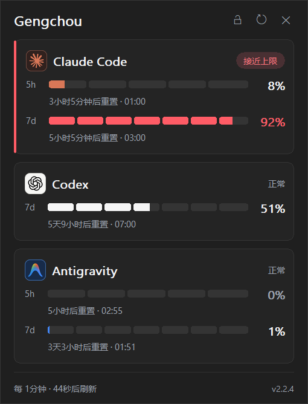
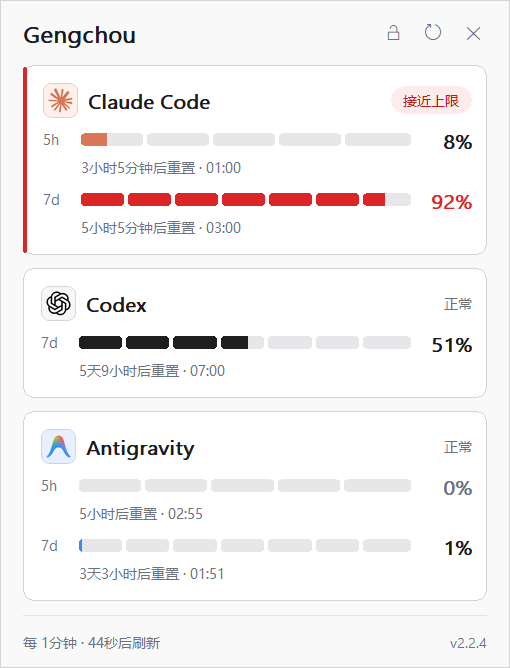

[English](README.md) | **简体中文**

<!-- 修改用户可见行为、安装方式、隐私说明或发布状态时，请同步更新 README.md。 -->
<!-- 所有预览图均由应用自身渲染；用 tools\render-readme-images.ps1 重新生成。 -->

<div align="center">

# 更筹 Gengchou

**AI 配额，一目了然。**

<sub>Windows 任务栏 AI 配额监控工具</sub>


[](https://github.com/yinjianxxx/gengchou/actions/workflows/ci.yml)
[](https://github.com/yinjianxxx/gengchou/releases/latest)
[](LICENSE)

 

<sub>详情弹窗的深色和浅色主题，图中还展示了接近上限时的警示样式。</sub>

</div>

更筹 Gengchou（读作 `gēng chóu`）把服务商实际返回的配额窗口、已用比例和重置时间直接放到 Windows 任务栏。Claude Code、Codex 和 Antigravity 都能实时显示；你可以选择完整的详情卡片，也可以只保留托盘数字，不必再打开各家的控制台查看配额。

> 烧香知夜漏，刻烛验更筹。
>
> ——南朝梁·庾肩吾《奉和春夜应令》

“更筹”是古代夜间计时、报更用的筹签，也可借指时间。

## 视图总览

|  | 深色 | 浅色 |
| ---: | :--- | :--- |
| **任务栏组件** |  |  |
| **浮窗** |  |  |
| **托盘图标** |  |  |

这些预览图均由应用的 `--dump-widget`、`--dump-tray-icons` 和 `--dump-detail-popup` 模式渲染，显示的是发布代码直接绘制的结果。可运行 [`tools/render-readme-images.ps1`](tools/render-readme-images.ps1) 重新生成。

- **任务栏组件**嵌入任务栏本体。每家服务商对应一个内容自适应的单行徽章，显示 logo、配额窗口标签和短窗口用量。悬停徽章可查看该服务商报告的所有配额窗口及重置时间；拖动左侧分隔线可调整位置，拖到另一条任务栏即可切换显示器。Explorer 暂时不可用时，组件会保持隐藏，并在任务栏恢复后重新嵌入。
- **浮窗**是独立的置顶数字视图。每家服务商最多显示两个用量最高的配额窗口，标签、百分比和倒计时排列在各自的微量表上方。浮窗任意位置均可拖动，短按则打开详情弹窗。位置会跨重启保存，并与工作区边缘保持 8 个逻辑像素的间距；也可在**设置**中恢复默认位置。
- **托盘图标**会为每个已启用的服务商显示一枚实时图标。数字和自适应量条取自接口实际返回的配额窗口；暂无数据时显示服务商首字母。关闭**图标**后只保留一个中性软件图标。
- **详情弹窗**可从任意视图左键打开，显示各服务商的状态、精确重置时间和刷新倒计时，并可临时锁定本次打开的位置。

任何配额窗口达到 90% 时，对应服务商的徽章会变红，并显示该窗口的重置倒计时：

<div align="center">

</div>

## 安装

推荐按以下顺序选择安装方式：

1. **便携 ZIP（推荐）。** 从[最新 Release](https://github.com/yinjianxxx/gengchou/releases/latest) 下载 `gengchou-windows-x64.zip`，解压到任意可写目录后运行 `gengchou.exe`。压缩包还包含中英文 README、许可证和归属声明。

2. **独立 EXE。** 如需单文件下载，可从同一 Release 获取 `gengchou.exe`，放在任意可写目录直接运行。

3. **WinGet（计划从 v2.3.0 开始提供）。** 内部迁移全部完成后，新包将使用以下标识：

   ```powershell
   winget install --id yinjianxxx.Gengchou --exact
   ```

   新包发布前，请使用 ZIP 或 EXE。

可执行文件目前未做代码签名。每个 Release 都提供 `SHA256SUMS`，应用内更新也会核对校验值。从 v2.1.0 起，发布资产还带有 GitHub artifact attestation，可用于核验构建来源，但不能替代 Authenticode 签名。

名称相近的 `CodeZeno.ClaudeCodeUsageMonitor` 是原项目的软件包，不是本应用。

<details>
<summary><b>从源码构建</b>（Windows 10/11，稳定版 Rust）</summary>

```powershell
git clone https://github.com/yinjianxxx/gengchou.git
cd gengchou
cargo build --release --locked
.\target\release\gengchou.exe
```

</details>

发布维护者还应执行[发布检查清单](docs/RELEASE_CHECKLIST.md)。

## 操作方式

- **左键单击**组件或托盘图标，打开或关闭详情弹窗。
- 详情弹窗默认可移动；单击锁定按钮可在本次打开期间固定位置，关闭后再次打开会恢复自动定位和可移动状态。
- **右键单击**任意视图打开菜单，直接单击**图标**、**小组件**或**浮窗**即可切换对应视图。位置重置、通知和开机启动等选项位于**设置**。
- 展开**刷新**后，可单击顶部的**现在**立即刷新，也可选择自动刷新频率。

## 视图之外

- 配额数据来自各服务商实际返回的窗口和重置时间，不做猜测或外推
- Claude Code、Codex、Google Antigravity 可任意组合启用
- 高对比度模式下使用 Windows 系统颜色
- 可选的重置通知（默认关闭）
- 在 `explorer.exe` 重启和 RDP/锁屏切换后自动恢复；锁屏期间仍按既定间隔轮询，恢复时只重建本地界面，不额外发送请求
- 支持多显示器、多任务栏
- 11 种语言 · 无遥测 · 单个约 1 MB 的便携可执行文件

## 服务商要求

本应用只读取本机已有的登录会话，不会创建账户或绕过服务商身份验证。可显示的内容取决于各服务商的账户规则：

- **Claude Code**：已安装并完成登录；存在可用 WSL 发行版时，也会读取 WSL 中的凭据
- **Codex**：已登录的 Codex Desktop 或 CLI 会话；如果 Desktop 已保存受支持的本地会话，无需另外安装 CLI
- **Antigravity**：已登录的 Antigravity 会话

## 数据与隐私

| 内容 | 位置 |
| --- | --- |
| 设置 | `%APPDATA%\Gengchou\settings.json` |
| 用量缓存——仅百分比、配额窗口元数据和重置时间，绝不含令牌 | `%APPDATA%\Gengchou\usage-cache.json` |
| 诊断日志（只追加、自动轮换） | `%LOCALAPPDATA%\Gengchou\diagnose.log` |

v2.2.4 是一次性迁移版本。第一次正常启动时，它会核对并复制设置和仍然有效的用量缓存，同时迁移开机启动项；旧文件暂时保留。退出更筹，再启动一次，第二次启动会清理由本项目拥有的已知旧文件。CodeZeno 原应用的数据只会在必要时作为设置回退来源读取，绝不会删除。旧目录里如果有不认识的文件或重解析点，应用仍可正常监控，但会保留这些文件并继续停用更新，等待人工核对。迁移完成前，应用不会检查或安装后续版本，以免意外跳过这个桥接步骤。

从旧版本升级并完成第二次启动后，把 Release 中的 `verify-v2.2.4-migration.ps1` 与 `SHA256SUMS` 放在同一目录，再运行 `verify-v2.2.4-migration.ps1 -RequireMigratedSource -RequireOfficialHash`。如果是没有旧设置的 v2.2.4 全新安装，则省略 `-RequireMigratedSource`。脚本会检查官方文件哈希、运行版本、迁移状态、设置、开机启动项、运行时身份和本项目旧数据目录。旧诊断日志不会复制；v2.2.4 会在新目录中重新记录。

卸载前，如已启用**开机启动**，请先在菜单中关闭，然后删除可执行文件、`%APPDATA%\Gengchou` 和 `%LOCALAPPDATA%\Gengchou` 两个目录。

网络请求会直接发往已启用的服务商（Anthropic、ChatGPT/Codex、Google）查询用量；检查更新或用户确认更新时还会连接 GitHub。本应用不会：

- 收集分析或遥测数据，或上传任何文件；
- 将凭据发送给签发者以外的任何一方；
- 修改你的凭据；
- 触发模型生成；不会运行 `claude -p`、`codex exec`，也不会调用 `/v1/messages`、`/v1/chat/completions` 等生成端点。

服务商 Bearer 令牌包含在每个 TLS 请求中，请只配置你信任的代理。

## 稳定性

本项目最初从原项目的稳定性改造开始。遇到外部 `WM_DESTROY`、`explorer.exe` 任务栏重建或 RDP 会话切换时，应用会先尝试在进程内恢复，只有失败后才重启进程。panic 会写入诊断日志。技术摘要见 [PROVENANCE.md](PROVENANCE.md)（英文）。

## 致谢与许可证

更筹原名 **AI Usage Monitor**，最初派生自 [CodeZeno/Claude-Code-Usage-Monitor](https://github.com/CodeZeno/Claude-Code-Usage-Monitor) v1.4.8（提交 `9b29972`），现已独立开发（[项目起源](PROVENANCE.md)）。托盘图标的呈现方式，以及部分 Claude 用量轮询、缓存、冷却和速率限制处理，改编自或参考了 [jens-duttke/usage-monitor-for-claude](https://github.com/jens-duttke/usage-monitor-for-claude)。本项目与 Code Zeno Pty Ltd、Anthropic、OpenAI 或 Google 不存在从属、认可或赞助关系。产品名仅用于说明兼容性；所有商标归各自权利人所有。

MIT License。保留的许可与归属声明见 [LICENSE](LICENSE)、[THIRD_PARTY_NOTICES.md](THIRD_PARTY_NOTICES.md) 和 [DEPENDENCY_LICENSES.md](DEPENDENCY_LICENSES.md)。
